# Homi365 Affiliate Blueprint — Mô hình hóa luồng nghiệp vụ & danh sách màn hình

*Homi365 · Affiliate / MLM · Phase 1 (pilot CN02) — tổng hợp 05/09/2026 · **cập nhật 08/09/2026***

Nguồn: trang tính **Homi365_CNTT – Requirement_092026** (bản 04/09/2026, 5 sheet có dữ liệu, 48 mã yêu cầu: 45 P0 · 3 P1) + **Homi365_Estimation_Checklist.xlsx** (WBS 33 task, 03/09/2026) + quyết định 05/09 + **phản hồi khách hàng 08/09** (mục 10).

> **Bản 08/09 thay đổi 5 điểm cốt lõi** so với bản 05/09: khách upload biên lai khi báo chuyển khoản · đăng ký xong vào thẳng dashboard ở trạng thái *chờ kích hoạt* · hoa hồng treo tới khi kích hoạt · kích hoạt tách 2 người 2 màn (Admin xác nhận thanh toán → Manager kích hoạt Agent) · Admin chọn mã kích hoạt và kích hoạt luôn, hệ thống gửi email mã cho khách. Chi tiết và lý do ở **mục 10**.

---

## 0. Tổng quan trang tính

Trang tính là tài liệu requirement "sống": ghi chú trao đổi stakeholder theo ngày (03/09, 04/09, 08/09) chồng lên yêu cầu gốc. Mô hình lấy **quyết định mới nhất** làm chuẩn, mâu thuẫn liệt kê ở mục 6.

| Sheet | Nội dung | Vai trò trong mô hình |
|---|---|---|
| 1. Overview | Bối cảnh, tầm nhìn, mô hình kinh doanh, mục tiêu, 3 nhóm người dùng, link mockup HTML 04/09 | Xác định actor, phạm vi Phase 1 |
| 2. Functional Requirement | 48 yêu cầu theo màn hình (LP-x, 7.x.x, 6.1.C-x, 8.1.C-x), acceptance criteria, ghi chú stakeholder | Nguồn chính cho luồng & màn hình |
| 3. (không có) | Không có sheet 3; sheet 2 thiếu dòng #13, 17, 20, 32, 41–43, 45 (đã xóa) | Ghi nhận để hỏi lại |
| 4. Non-functional | Bảo mật, độ chính xác, mở rộng, hiệu năng | Ràng buộc kỹ thuật |
| 5. Logic hoa hồng | Mục A–H: chênh lệch cấp bậc, bảng hạng, thăng/hạ hạng, tuyển, breakaway, 5 case ví dụ, điểm, vận hành | Đặc tả engine F4/F5 |
| 6. Glossary | 9 thuật ngữ | Thống nhất từ vựng |

## 1. Phân tích từng sheet

### Sheet 1 · Overview
Homi365 bán gói chăm sóc sức khỏe từ xa (đồng hồ thông minh + bác sĩ 24/7, gói CN02). Hiện bán trực tiếp, chưa có cơ chế khách hàng giới thiệu. Dự án xây nền tảng affiliate/MLM: khách đã mua → **agent**, có link giới thiệu; người mua qua link → **tuyến dưới**. Mục tiêu Phase 1: validate mô hình trên 1 sản phẩm; agent theo dõi đơn/điểm/hạng; admin quản lý thành viên + duyệt rút tiền; **gán tuyến trên–dưới chính xác 100%**.

Actor: **Khách hàng mới** (bấm link → mua → tự động là tuyến dưới, không cần tài khoản) · **Agent/thành viên** (đã mua, đăng ký, có ref_code + link cá nhân) · **Admin Specialist** · **Manager** (mới 08/09) · **Head Admin**.

### Sheet 2 · Functional Requirement
48 dòng: Public 4 · Agent 16 · Admin 20 · Logic 8.

| Nhóm | Mã YC | Ý chính | Quyết định mới nhất |
|---|---|---|---|
| Public — Landing + form mua (A1) | LP-1, 2, 3, 6 | Link có ref_code, không đăng nhập; form mua; sau thanh toán ghi đơn + tạo KH + gán tuyến ngay; 2 lựa chọn Đăng ký / Thoát | 04/09: bỏ mã đơn 16 ký tự, **validate đăng ký bằng SĐT**; ref_code sai → lỗi. **08/09: chuyển khoản phải đính kèm ảnh biên lai** |
| Agent — Đăng nhập (C1) | 7.1.1–7.1.3 | SĐT + mật khẩu; quên MK OTP/email; đã mua chưa agent → redirect đăng ký | Lỗi không lộ SĐT tồn tại. **08/09: trạng thái *chờ kích hoạt* cũng đăng nhập được** |
| Agent — Đăng ký | 7.2.1–7.2.8 | Nhận diện KH vừa mua; autofill; OTP 5' / sai 3 lần; sinh ref_code + link; gán tuyến trên từ đơn; T&C lưu bản ghi; chặn trùng; quay lại vẫn autofill | Chỉ mời khi **người giới thiệu ≥ Silver**; email admin@homi365.com.vn gửi 2 link + portal; khởi điểm Copper. **08/09: nộp xong vào thẳng dashboard, không chờ duyệt; ref_code + link cấp ngay** |
| Agent — Dashboard | 7.3.2, 3, 4, 6, 10 | Đơn theo thời gian; điểm + hạng + còn thiếu; hoa hồng 4 trạng thái; rút tiền; biểu đồ | **1 điểm = 1 VNĐ**; rút **1 lần/tháng**; hold khi chờ duyệt. **08/09: chưa kích hoạt → điểm = 0, hoa hồng trạng thái *tạm giữ*** |
| Admin — Đăng nhập | 7.4.1 | Email/username + MK, tách khỏi agent | — |
| Admin — Thành viên | 7.5.1–7.5.5 | Danh sách; chi tiết (cây 2–3 cấp, 3 lịch sử); lọc; khóa/mở (P1); export | **Giáng 1 bậc** nếu tháng không bán; khóa → khóa link. **08/09: thêm trạng thái *Chờ kích hoạt*** |
| Admin — Rút tiền | 7.6.1–7.6.5 | Danh sách; TK nhận; duyệt/từ chối lý do; đã chi trả (tay); log | 7.9.3 → **duyệt 2 lớp** (giữ nguyên) |
| Admin — Kho hàng | 7.8.1–7.8.5 | Thiết bị/mã kích hoạt; in_stock → assigned → activated; summary; lọc; export | Phân trang 1.000+. **08/09: Admin chọn mã khi xác nhận thanh toán và kích hoạt luôn; hệ thống gửi email mã cho khách** |
| Admin — Phân quyền & duyệt 2 lớp | 7.9.1–7.9.4 | Specialist / Head Admin; 2 lớp cho đăng ký & rút tiền; Head tự chốt; người 2 ≠ người 1; timeline | Duyệt **không chặn** gán tuyến/hoa hồng lúc mua. **08/09: thêm vai Manager; kích hoạt agent = Admin xác nhận thanh toán (lớp 1) + Manager kích hoạt (lớp 2), bỏ cơ chế 2 lớp cũ ở màn đăng ký** |
| Logic | 7.7.1, 6.1.C-1/2/3/5, 8.1.C-4/5, #50 | Product; ref_code duy nhất; tracking 0% lỗi; engine; idempotency; link `Homi365.com.vn/[EEEE][PPPP]` + hậu tố -2/-3; tuyển ≥ Silver | Bỏ webhook hệ thống order ngoài |

### Sheet 4 · NFR
Mã hóa dữ liệu tài chính; phân quyền; gán tuyến/hoa hồng chính xác tuyệt đối + log truy vết; mở rộng nhiều sản phẩm/tầng; dashboard < 2–3 s (vài trăm tuyến dưới), kho < 2–3 s (1.000+ thiết bị).

### Sheet 5 · Logic hoa hồng
Mô hình **chênh lệch cấp bậc**: người bán nhận trọn mức hạng mình; mỗi upline nhận chênh lệch giữa hạng mình và hạng cao nhất đã nhận bên dưới; hạng trống dồn lên; tổng chi/gói = 3.850.000đ; thiếu Lithium → công ty.

| Hạng | HH/gói | Chênh lệch | Gói lũy kế lên hạng kế | Lũy kế cộng dồn | Quyền |
|---|---|---|---|---|---|
| Lithium | 3.850.000 | 50.000 | — | 30 | Tuyển + bán |
| Titanium | 3.800.000 | 100.000 | 2 | 28 | Tuyển + bán |
| Diamond | 3.700.000 | 200.000 | 4 | 24 | Tuyển + bán |
| Gold | 3.500.000 | 500.000 | 6 | 18 | Tuyển + bán |
| Silver | 3.000.000 | 1.000.000 | 8 | 10 | Tuyển + bán |
| Copper | 2.000.000 | — | 10 | 0 | **Chỉ bán** |

- C. Khách hàng trước → agent; đơn sau khi là agent mới tính; lũy kế, **nhảy cấp**; không bán ≥1 gói/tháng → hạ hạng; xử lý **0h cuối tháng** sau khi tính hoa hồng.
- **C-bis (chốt 08/09)**: số gói **cộng dồn qua các tháng**. Ví dụ khách đưa: đang Silver, tháng này bán 2 gói, tháng sau bán 6 gói → cộng dồn 8 gói → lên Gold. Mỗi tháng chỉ cần bán ≥ 1 gói để không bị giáng.
- **C-ter (chốt 08/09)**: khi **bị giáng**, lũy kế **lùi về đúng ngưỡng của hạng mới**. Một tháng không kích hoạt gói nào: Gold (lũy kế 18) rớt xuống Silver và lũy kế còn 10 — muốn trở lại Gold phải **bán thêm 8 gói**. Đây là điểm khác với "không reset": cộng dồn áp dụng cho các tháng bán bình thường, còn giáng hạng thì cắt phần vượt ngưỡng. Cấu hình `CONFIG.rankRules.demoteCumulative = 'rank-floor'` (hai lựa chọn khác: `keep` giữ nguyên, `zero` xoá trắng).

  **Mất tiến độ dở dang là có chủ ý** (khách xác nhận 08/09): Gold đang có lũy kế 22 — tức đã đi được 4/6 gói tới Diamond — nếu một tháng không kích hoạt gói nào thì rớt Silver và lũy kế về đúng 10, mất cả 12 gói tiến độ. Tháng không bán được thì rớt hẳn, không giữ phần dở dang. Dev **không** coi đây là lỗi làm tròn hay bug mất dữ liệu.
- D. Công ty chỉ định agent đầu tiên; mới vào = Copper; **Copper không tuyển — hệ thống báo lỗi ngay cho khách hàng ở màn đăng ký**; khuyết Lithium → công ty đóng vai Lithium.
- E. Breakaway: downline ngang hạng → chênh lệch 0 → nhánh tách.
- F. 5 case, Σ luôn = 3.850.000 × số gói (Case 5: 4tr + 4tr + 6tr + 5,25tr = 19,25tr ✓).
- G. Điểm: 1 VNĐ = 10 điểm (mâu thuẫn với 04/09: 1 điểm = 1 VNĐ).
- H. Rút 1 lần/tháng, chi trả đầu tháng kế tiếp.
- **I (mới 08/09)**: hoa hồng của agent **chưa kích hoạt** ghi trạng thái *Tạm giữ · chờ kích hoạt* — không vào số dư khả dụng, không quy đổi điểm. Khi Manager kích hoạt, toàn bộ khoản treo chuyển sang *Đã ghi nhận* và lũy kế đơn được tính lại.

### Sheet 6 · Glossary
Glossary nói "điểm dùng xét hạng" trong khi sheet 5 xét hạng theo số gói lũy kế — cần thống nhất.

## 2. Actor & phân hệ

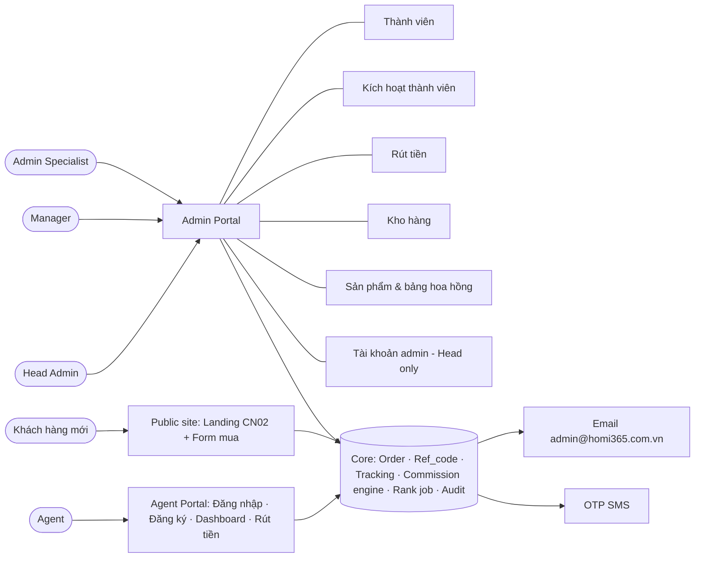

**Ma trận quyền (chốt 08/09)**

| Hành động | Màn | Specialist | Manager | Head |
|---|---|---|---|---|
| Xác nhận thanh toán + chọn & kích hoạt mã | Đơn hàng | ✅ | ❌ | ✅ |
| Kích hoạt Agent | Kích hoạt thành viên | ❌ | ✅ | ✅ |
| Duyệt rút tiền (2 lớp) | Rút tiền | ✅ | ✅ | ✅ (chốt 1 lượt) |
| Tài khoản admin | Tài khoản admin | ❌ | ❌ | ✅ |

**Ràng buộc tách người (bảng lỗi kỹ thuật #1, Mức 1)**: trên **cùng một hồ sơ**, người đã xác nhận thanh toán (lớp 1) **không được** kích hoạt Agent (lớp 2). Head Admin có cả hai vai nhưng vẫn chịu ràng buộc này — Head làm lớp 1 thì lớp 2 phải là Manager (hoặc một Head khác), và ngược lại. Cấu hình: `CONFIG.activation.distinctApprovers = true`.

## 3. Luồng nghiệp vụ

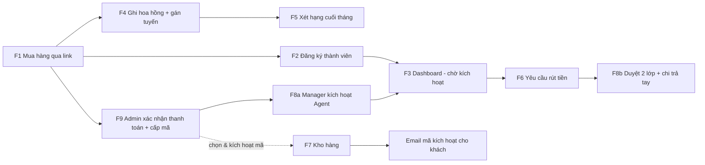

### F1 · Mua hàng qua link (LP-1/2/3/6, 6.1.C-2/5, 8.1.C-4/5, 7.2.1, #50, 7.8.2)

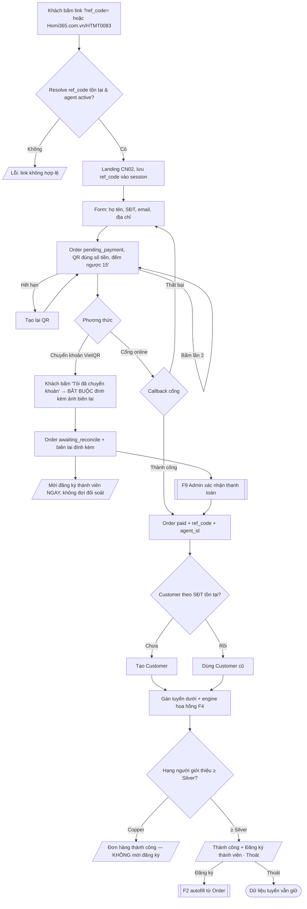

Chốt 05/09: landing, Order và thanh toán nằm trong Homi365; "webhook GoCare" trong WBS = callback cổng thanh toán.
Chốt 08/09: **biên lai là bắt buộc** với luồng chuyển khoản; hệ thống **không phân biệt chuyển đúng/sai** ở bước này — mọi đơn vào *Chờ đối soát*, Admin đối chiếu ảnh rồi xác nhận hoặc từ chối. Lời mời đăng ký hiện **ngay khi gửi biên lai**, không đợi đối soát.

### F2 · Đăng ký thành viên (7.1.3, 7.2.1–7.2.8, #50, 8.1.C-1/4/5)

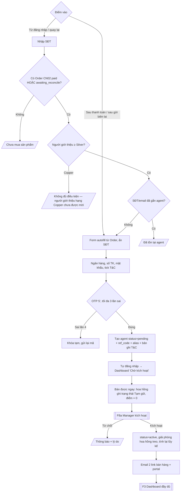

**Thay đổi 08/09 so với bản 05/09**: ref_code và link cá nhân sinh **lúc nộp form**, không phải sau lượt duyệt thứ 2 — vì agent cần link để bán ngay. Câu hỏi mở #4 (thời điểm sinh ref_code) khép lại theo hướng này.

### F3 · Đăng nhập agent (7.1.x, 7.3.x)

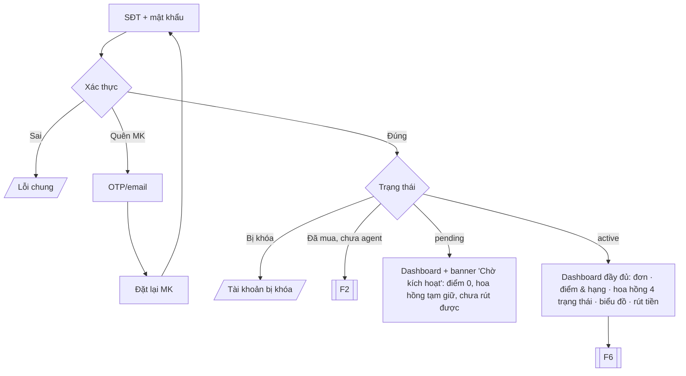

### F4 · Engine hoa hồng (6.1.C-3, sheet 5 A/B/E/G/I)

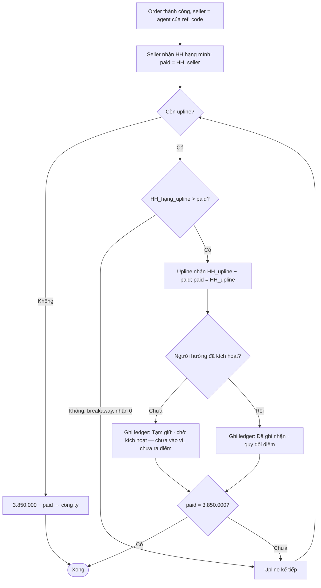

Bất biến: Σ phân bổ mỗi gói = 3.850.000đ **kể cả khi có khoản đang tạm giữ** — treo là trạng thái chi trả, không phải bỏ phân bổ. Hạng dùng tính = hạng tại thời điểm đơn.

### F5 · Job xét hạng cuối tháng (sheet 5 C/C-bis/H, 7.5.2 note)

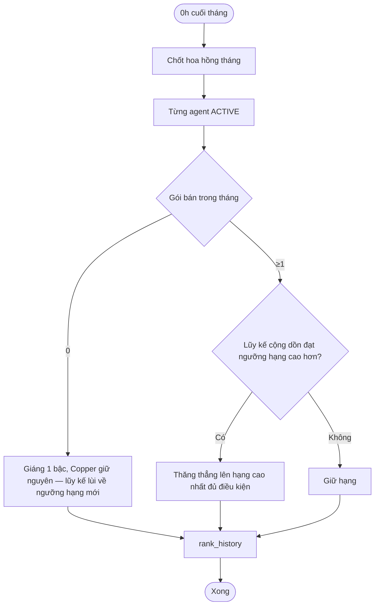

Agent `pending` không nằm trong vòng lặp xét hạng — chưa kích hoạt thì chưa tính hạng.

### F6 · Rút tiền (7.3.4/6, 7.6.x, 7.9.3/4, sheet 5 H)

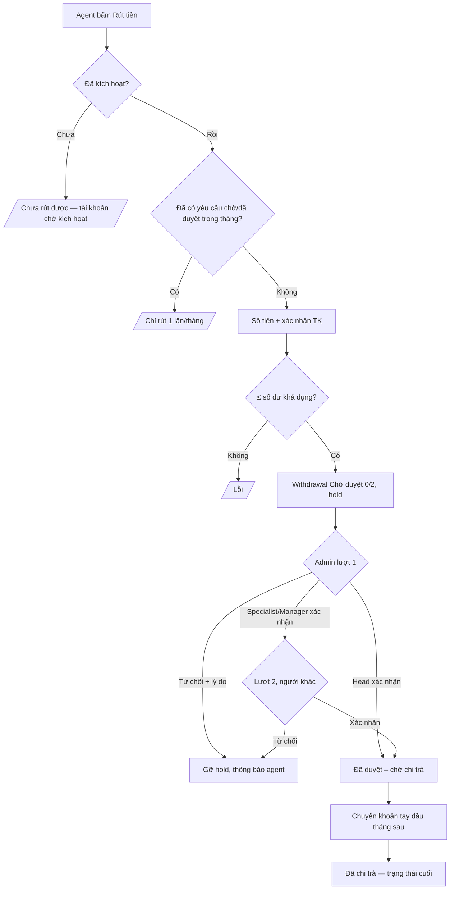

Khả dụng = Đã ghi nhận − Hold − Đã rút. **Khoản Tạm giữ không tính vào khả dụng.** Người tạo hộ không được tự duyệt.

### F7 · Kho hàng (7.8.x) — cập nhật 08/09

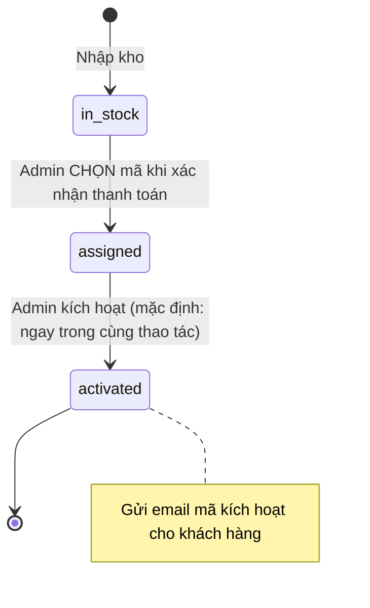

Khác bản 05/09: trước đây hệ thống tự lấy mã bất kỳ và **khách** là người kích hoạt. Nay **Admin chọn mã từ danh sách mã đang `in_stock`** (kèm serial thiết bị) — nhờ vậy không thể có hai đơn trùng mã — và kích hoạt luôn trong cùng thao tác. Đơn thanh toán qua cổng online không có Admin can thiệp nên dừng ở `assigned`; Admin kích hoạt sau tại màn Kho hàng.

### F8a · Kích hoạt Agent — 2 người, 2 màn (7.9.x, chốt 08/09)

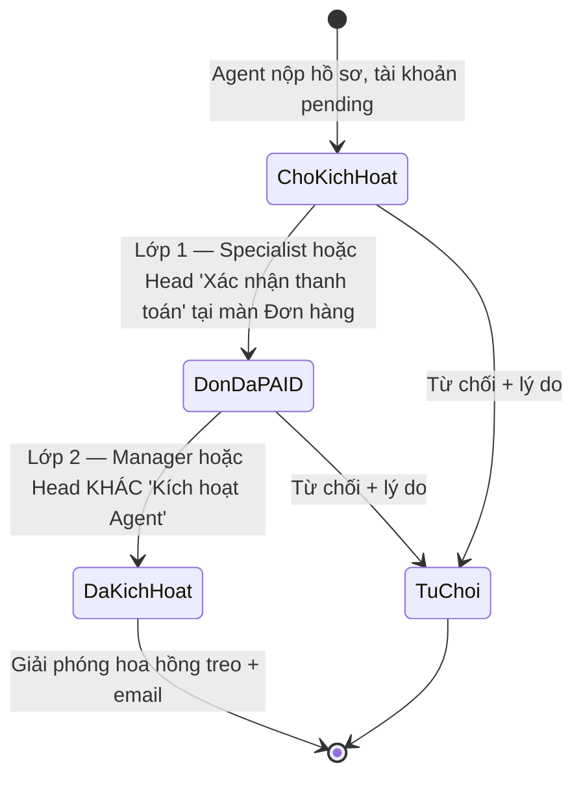

Hai chốt chặn:

1. Nút "Kích hoạt Agent" **khoá** khi đơn chưa `paid` — *"Chờ Admin xác nhận thanh toán đơn HMxxx"*. Có tiền thật rồi mới kích hoạt.
2. Nút "Kích hoạt Agent" **khoá với chính người đã xác nhận thanh toán** đơn đó — *"Bạn đã xác nhận thanh toán đơn HMxxx (lớp 1). Lớp 2 phải do người khác kích hoạt."* Áp dụng cho cả Head Admin.

Modal xác nhận thanh toán cảnh báo trước: nếu người mua đã nộp hồ sơ thành viên, admin được báo rằng bấm xác nhận đồng nghĩa mất quyền kích hoạt agent đó.

### F8b · Duyệt 2 lớp rút tiền (7.9.x — giữ nguyên)

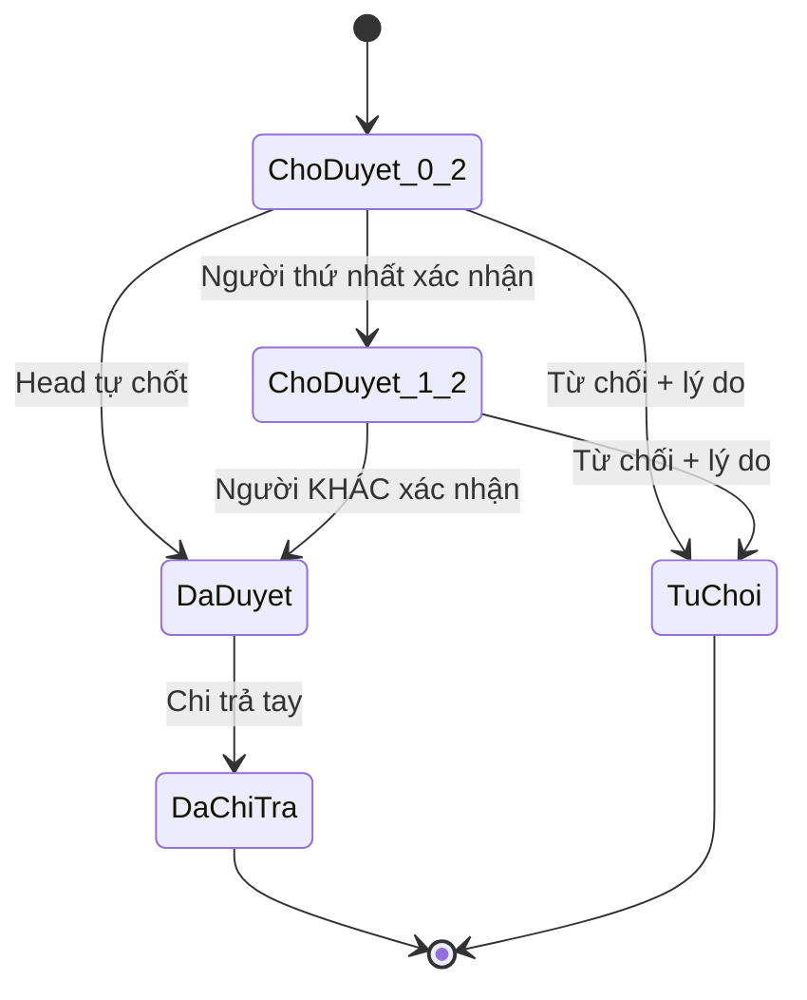

### F9 · Admin xác nhận thanh toán & cấp mã (mới 08/09 — 7.8.2, 6.1.C-4)

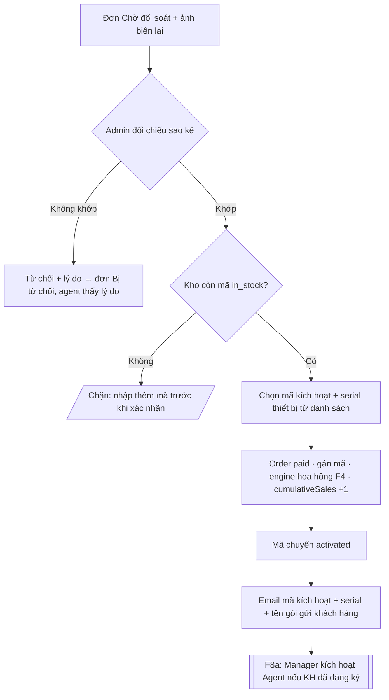

## 4. Cây màn hình (phân nhánh)

Mỗi màn: **Cần thông tin** · **Input** · **Đầu ra** · **Rule**.

### PUBLIC (không đăng nhập)

**A0 · Resolver link** (LP-1, 8.1.C-4/5, 6.1.C-2)
- Cần: bảng ref_code ↔ agent (active/pending/khóa); bảng alias EEEEPPPP ↔ ref_code.
- Input: URL `?ref_code=` hoặc `/HTMT0083`.
- Đầu ra: hợp lệ → A1 (lưu session); không hợp lệ/khóa → A1-ERR; ghi click.
- Rule: ref_code sống xuyên phiên; khóa agent → link vô hiệu. **Agent `pending` vẫn bán được — link hoạt động, hoa hồng treo.**

**A1 · Landing CN02 + Form mua** (LP-1/2, 6.1.C-5, 7.7.1)
- Cần: product (tên, giá, ảnh); ref_code + người giới thiệu.
- Input: họ tên, SĐT, email, địa chỉ; thanh toán (idempotency key).
- Đầu ra: Order + ref_code + agent; Customer mới/cũ theo SĐT; gán tuyến + engine → A2.
- Rule: không cần tài khoản; bấm nhiều lần không trùng Order.

**A1.1 · Thanh toán QR** (WBS #2/#17/#18, LP-4/5)
- Cần: Order pending_payment (order_id, số tiền); QR; hết hạn 15'.
- Input: quét QR; Tạo lại QR; **"Tôi đã chuyển khoản" → modal đính kèm ảnh biên lai (bắt buộc, ≤ 5MB)**.
- Đầu ra: cổng → callback → paid → A2; chuyển khoản → awaiting_reconcile + biên lai → A2 (biến thể chờ đối soát).
- Rule: chưa đính kèm thì nút xác nhận vẫn khoá; không phân biệt chuyển đúng/sai tại đây.

**A1-ERR · Link không hợp lệ** — thông báo lỗi, không hiển thị form.

**A2 · Kết quả đơn** (LP-3/6, 7.2.1, #50)
- Cần: Order vừa tạo; hạng agent giới thiệu; biên lai (nếu có).
- Input: ≥ Silver → Đăng ký thành viên / Thoát; Copper → chỉ Thoát.
- Đầu ra: Đăng ký → C2 (autofill, ẩn SĐT); Thoát → kết thúc, dữ liệu vẫn lưu.
- Rule: **modal mời đăng ký hiện ở cả trạng thái Chờ đối soát và Đã thanh toán**, mỗi chặng một lần.

### AGENT PORTAL

**C1 · Đăng nhập** (7.1.1/3) — Input SĐT, mật khẩu; đầu ra: active hoặc pending → C3; đã mua chưa agent → C2; sai → lỗi chung.
- **C1.1 · Quên/đặt lại MK** (7.1.2) — SĐT/email → OTP → MK mới ×2.

**C2 · Đăng ký làm agent** (7.2.2, 7.2.5–7.2.8, #50)
- Cần: Order/Customer theo SĐT; agent giới thiệu + hạng; T&C phiên bản; danh sách SĐT/email agent.
- Input: SĐT (ẩn khi từ A2); họ tên, email (autofill); ngân hàng, số TK; mật khẩu; tick T&C; Gửi OTP.
- Đầu ra: lỗi chưa mua / **Copper (hiện thông báo rõ cho khách)** / trùng; thành công → **tự đăng nhập, vào thẳng C3**.
- Rule: quay lại sau Thoát vẫn autofill; họ tên là nguồn sinh alias.
- **C2.1 · OTP** (7.2.3) — 5', sai lần 4 khóa tạm.
- ~~C2.2 · Chờ duyệt~~ — **bỏ 08/09**, thay bằng banner "Chờ kích hoạt" trên C3.

**C3 · Dashboard** (7.3.2/3/4/6/10)
- Cần: Orders theo ref_code; điểm, hạng, còn thiếu; ledger 4 trạng thái + **Tạm giữ**; withdrawal đang mở; ref_code, 2 link; danh sách F1.
- Input: chọn khoảng thời gian; Rút tiền → C3.1; copy link.
- Đầu ra: số liệu + biểu đồ. Rule: < 2–3 s; khả dụng trừ hold **và trừ khoản tạm giữ**.
- **Trạng thái pending**: banner "Tài khoản đang chờ kích hoạt" + số khoản/tổng tiền đang tạm giữ; điểm hiển thị 0; "Gói bán luỹ kế" ghi rõ *cộng dồn qua các tháng*.
- **C3.1 · Form rút tiền** (7.3.6, 7.9.3) — chặn khi pending; số tiền, xác nhận TK → 0/2, hold.
- **C3.2 · Lịch sử hoa hồng, rút tiền & hạng** — ledger có thêm 2 loại bút toán: *Hoa hồng tạm giữ* (effect 0) và *Giải phóng sau kích hoạt* (effect +).

### ADMIN PORTAL

**D1 · Đăng nhập admin** (7.4.1, 7.9.1) — username + MK; phiên riêng, menu theo vai (Specialist / Manager / Head).

**D2 · Quản lý thành viên** (7.5.1/3/5) — bảng tên, liên hệ, ref_code, tuyến trên, hạng, ngày tham gia, trạng thái (**Đang hoạt động / Chờ kích hoạt / Đã khoá**); tìm/lọc; export.
- **D2.1 · Chi tiết agent** (7.5.2/4) — hồ sơ + TK ngân hàng; cây tuyến dưới 2–3 cấp; lịch sử đơn/hoa hồng/hạng; Khóa/Mở khóa.
- **D2.2 · Tạo agent gốc / chỉ định hạng** (Head Admin) — agent active không qua duyệt; rank_history "chỉ định".

**D3 · Kích hoạt thành viên** (7.9.2/4 — đổi tên từ "Duyệt đăng ký") — danh sách KH, SĐT, người giới thiệu, trạng thái, **đơn gắn kèm**.
- **D3.1 · Chi tiết + timeline** — form, Order gốc, T&C, số hoa hồng đang tạm giữ; **nút "Kích hoạt Agent"** (Manager/Head, khoá tới khi đơn `paid`) / Từ chối + lý do; kích hoạt → giải phóng hoa hồng + email.

**D4 · Yêu cầu rút tiền** (7.6.1, 7.9.4) — agent, số tiền, ngày, trạng thái.
- **D4.1 · Chi tiết** (7.6.2–7.6.5, 7.9.3) — TK nhận; số dư thực tế; timeline + log; Xác nhận/Từ chối; Đánh dấu đã chi trả.

**D5 · Kho hàng** (7.8.1–7.8.5) — mã SP, mã kích hoạt, Order, agent, ngày nhập, trạng thái; summary 3 thẻ; lọc/tìm; export; phân trang.
- **D5.1 · Chi tiết thiết bị** — vòng đời; **nút "Kích hoạt mã & gửi email"** cho mã đang `assigned`; **Sửa mã / serial** và **Gỡ khỏi kho** cho mã đang `in_stock` (đã gắn đơn thì khoá, tránh sửa mã khách đang cầm).
- **Nhập kho (chốt 08/09)**: mã kích hoạt **đi theo serial của từng máy**, do nhà sản xuất cấp — hệ thống **không sinh mã tự động**. Hai đường nhập: *Thêm mã theo serial* (từng máy) và *Nhập file* (lô theo file nhà sản xuất, mỗi dòng `mã;serial`). Serial bắt buộc, mã và serial đều phải duy nhất; dòng vi phạm bị bỏ qua và báo lại. Mọi thao tác nhập/sửa/gỡ đều ghi audit log.

**D6 · Quản lý tài khoản admin** (7.9.1, Head only) — tạo/sửa/vô hiệu, gán vai Specialist / Manager / Head.

**D7 · Quản lý sản phẩm** (7.7.1) — tên/giá/ảnh/bật tắt; bảng hoa hồng 6 hạng theo sản phẩm; tỷ lệ điểm; hạng tăng đơn điệu; lưu phiên bản.

**D8 · Đơn hàng & đối soát** — danh sách theo trạng thái; drawer chi tiết có **ảnh/biên lai khách gửi**, phân bổ hoa hồng, timeline.
- **D8.1 · Modal xác nhận thanh toán & cấp mã** (mới 08/09) — hiện số tiền, nội dung CK cần khớp, email nhận mã, biên lai; **dropdown chọn mã kích hoạt + serial** từ danh sách `in_stock`; xác nhận → paid + activated + email.

### HỆ THỐNG (không UI)
**S1** — sinh ref_code, alias EEEEPPPP + hậu tố, mã Order; job 0h cuối tháng, chi trả đầu tháng; **email mã kích hoạt cho khách**, email kích hoạt agent, OTP SMS, thông báo từ chối; audit log.

## 5. Thực thể dữ liệu

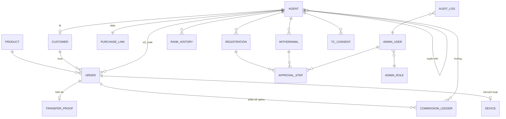

Trường mới 08/09: `ORDER.transfer_proof` (tên file, dung lượng, thời điểm) · `AGENT.status` thêm giá trị `pending` · `COMMISSION_LEDGER.status` thêm `pending_activation` + `released_at`/`released_by` · `DEVICE.activated_by` · `ADMIN_ROLE` thêm `MANAGER`.

## 6. Mâu thuẫn & câu hỏi mở

| # | Vấn đề | Nguồn | Trạng thái |
|---|---|---|---|
| 1 | Tỷ lệ điểm: sheet 5 1 VNĐ = 10 điểm vs 04/09 1 điểm = 1 VNĐ | Sheet 2 ↔ 5 | **Còn mở** — tạm lấy 04/09 |
| 2 | Điểm dùng xét hạng (glossary) vs hạng theo gói lũy kế (sheet 5) | Sheet 6 ↔ 5 | **Còn mở** |
| 3 | Duyệt rút tiền 1 cấp (7.6.3) vs 2 lớp (7.9.3) | Sheet 2 | Chốt: 2 lớp |
| 4 | Thời điểm sinh ref_code (7.2.4 vs 7.9.2) | Sheet 2 | ✅ **Chốt 08/09: sinh lúc nộp form**, agent bán được ngay |
| 5 | Hạ hạng: giáng 1 bậc; reset lũy kế? | Sheet 5 ↔ 7.5.2 | ✅ **Chốt 08/09**: các tháng bán bình thường thì lũy kế cộng dồn; khi **bị giáng** thì lũy kế lùi về đúng ngưỡng hạng mới (Sheet 5 C-bis + C-ter) |
| 6 | Khách mua qua link Copper là tuyến dưới nhưng không được đăng ký | LP-3 ↔ #50 | ✅ **Chốt 08/09: giữ chặn, hệ thống báo lỗi rõ cho khách** |
| 7 | Agent gốc do công ty/admin chỉ định — thiếu màn hình | Sheet 5 ↔ 2 | Đã bổ sung D2.2 |
| 8 | Domain: Homi365.vn vs Homi365.com.vn | Sheet 1 ↔ 2 | **Còn mở** |
| 9 | OTP lần 4: khóa tạm vs admin tạo lại MK | 7.2.3 | **Còn mở** |
| 10 | Từ chối đăng ký → nộp lại? Nội dung T&C? | 7.9.2, 7.2.6 | **Còn mở** (mặc định: cho nộp lại) |
| 11 | Kho hàng thiếu nhập kho / ai kích hoạt | 7.8.x | ✅ **Chốt 08/09: Admin chọn mã và kích hoạt, gửi email cho khách** |
| 12 | Rút 1 lần/tháng vs chi trả đầu tháng sau — mốc "tháng"? | 7.3.6 ↔ sheet 5 H | **Còn mở** |
| 13 | Dòng đã xóa (#13, 17, 20, 32, 41–43, 45), không có sheet 3 | Sheet 2 | **Còn mở** |
| 14 | Đơn bị từ chối đối soát nhưng agent đã đăng ký → xử lý hồ sơ thế nào? | Mới 08/09 | **Còn mở** — hiện hai luồng độc lập, Manager vẫn chặn được ở bước kích hoạt |
| 15 | Chuyển khoản sai số tiền/nội dung — quy trình liên hệ và bù trừ | Mới 08/09 | **Còn mở** — hiện chỉ hiển thị cảnh báo, vận hành gọi khách |

## 7. Bổ sung từ Homi365_Estimation_Checklist.xlsx

WBS 03/09/2026, đội Công Nghệ Tuổi Trẻ, 33 task (FE KH 3 · FE agent 4 · FE admin 6 · BE 17 · Server 3).

**Yêu cầu 04/09 chưa có trong WBS**: duyệt 2 lớp + timeline; phân quyền Specialist/Head + D6; link cá nhân EEEEPPPP; điều kiện tuyển ≥ Silver; validate bằng SĐT; giáng 1 bậc; email kích hoạt; màn chờ duyệt phía agent.

**Yêu cầu 08/09 chưa có trong WBS** (ước tính bổ sung):

| Hạng mục | Màn/luồng | Đề xuất | Giờ |
|---|---|---|---|
| Upload biên lai + lưu trữ file | A1.1, D8.1 | MFE + MBE | 16 |
| Trạng thái agent `pending` + hoa hồng treo + giải phóng | F2, F4, C3 | CBE | 16 |
| Tách vai Manager + ma trận quyền | D1, D3.1, D6 | SFE + MBE | 12 |
| Modal chọn mã khi xác nhận thanh toán | D8.1 | SFE + SBE | 12 |
| Email mã kích hoạt cho khách | S1, F7 | SBE | 4 |
| **Cộng thêm 08/09** | | | **60** |

Tổng đề xuất cập nhật: 510 + 60 = **570 giờ**.

## 8. Rà soát độ phủ

Mọi mã YC đều có luồng + màn hình tiếp nhận. Bổ sung để đủ: **D7** quản lý sản phẩm, **D2.2** tạo agent gốc/chỉ định hạng, **C3.2** lịch sử phía agent, **A1.1** thanh toán QR, **D8.1** modal xác nhận thanh toán & cấp mã (mới 08/09).

Còn trống trong tài liệu gốc: agent đổi TK ngân hàng/mật khẩu sau kích hoạt; redeem điểm mua hàng; khách mua qua link Copper đăng ký sau khi Copper lên Silver; kênh thông báo cho agent; **xử lý hồ sơ agent khi đơn bị từ chối đối soát** (mục 6 #14).

## 9. Đối chiếu prototype-v2 (08/09)

Prototype đã hiện thực toàn bộ quyết định 08/09. Cấu trúc: 23 file markup cho 25 route trong `screens/{buyer,seller,admin,common}`, mỗi màn một file, mảnh con nằm trong `` — xem `screens/INDEX.md`.

| Nhóm | Route | Trạng thái so với blueprint |
|---|---|---|
| Public | `#buy` `#payment` `#order-result` `#order-lookup` `#login` `#register` | ✅ có upload biên lai, mời đăng ký ở cả 2 chặng, chặn Copper |
| Agent | `#dashboard` `#my-package` `#wallet` `#profile` | ✅ banner chờ kích hoạt, hoa hồng tạm giữ, chặn rút tiền |
| Admin | `#orders` `#registrations` `#inventory` `#agents` `#products` `#ranks` `#withdrawals` `#admin-users` | ✅ modal chọn mã, kích hoạt + email, tách vai Manager |
| Logic | engine chênh lệch, rank job, ví, audit | ✅ thêm `pending_activation`, `releaseFrozenCommissions` |

Tài khoản demo — **2 người, đủ chạy trọn quy trình**: `head` (Trưởng bộ phận — lớp 1 xác nhận thanh toán, kèm quyền chỉ-Head) · `manager` (Ms Trinh — lớp 2 kích hoạt Agent) / `Homi@2026`. Vai `SPECIALIST` vẫn tồn tại trong hệ thống; bản thật Head cấp thêm tài khoản tại màn Tài khoản admin.

## 10. Nhật ký quyết định 08/09/2026

| # | Quyết định của khách | Trước đó (bản 05/09) | Ảnh hưởng |
|---|---|---|---|
| 1 | Khách chuyển khoản xong **phải upload ảnh biên lai** | Chỉ bấm "Tôi đã chuyển khoản" | A1.1, D8, F1 · trường `transfer_proof` |
| 2 | Không phân biệt chuyển đúng/sai lúc upload — Admin đối soát rồi xử lý | — | F1, F9 · câu hỏi mở #15 |
| 3 | **Mời đăng ký ngay sau khi gửi biên lai**, không đợi admin duyệt | Chỉ mời khi đơn đã `paid` | A2, F2 |
| 4 | Đăng ký xong **vào thẳng dashboard**, không chờ duyệt | Màn "Chờ duyệt 0/2" | C2.2 bỏ, C3 thêm banner |
| 5 | Chưa kích hoạt thì **dashboard không có điểm nào**; hoa hồng treo, trả sau khi kích hoạt | Không có trạng thái trung gian | F4 mục I, C3, C3.1, C3.2 |
| 6 | **Người 1 – Admin**: nút "Xác nhận thanh toán" khi thấy tiền về bank | Duyệt 2 lớp bởi 2 admin bất kỳ | F8a, D8.1, ma trận quyền |
| 7 | **Người 2 – Manager**: nút "Kích hoạt Agent" (double check), khoá tới khi đơn `paid` | — | F8a, D3.1 |
| 8 | Head Admin làm được cả hai **vai**, nhưng trên cùng một hồ sơ chỉ được một **lớp** | Head tự chốt 1 lượt | F8a · theo bảng lỗi kỹ thuật #1 (Mức 1) |
| 9 | Admin **chọn kèm thiết bị & mã** khi duyệt đơn — tránh trùng mã | Hệ thống tự lấy mã đầu tiên | F7, D8.1 |
| 10 | **Kích hoạt mã → gửi email mã kích hoạt cho khách hàng** | Không có email cho người mua | F7, F9, S1 |
| 11 | Bán ≥1 gói/tháng để không tụt hạng; **số gói cộng dồn qua các tháng** | Câu hỏi mở #5 | Sheet 5 C-bis, F5 — *xác nhận logic đang có là đúng, không phải sửa* |
| 14 | Mã kích hoạt **đi theo serial từng máy**, admin nhập/sửa tay — sinh tự động là sai | Sinh mã ngẫu nhiên hàng loạt, serial cũng sinh tự động | F7, D5, D5.1 · bỏ nút "Sinh hàng loạt", thêm "Thêm mã theo serial" + sửa/gỡ + audit |
| 13 | Khi bị giáng, **lũy kế lùi về ngưỡng hạng mới**: Gold rớt Silver còn 10, cần bán thêm 8 để lấy lại Gold | Giữ nguyên lũy kế → bán 1 gói là thăng lại ngay | Sheet 5 C-ter, F5 · `demoteCumulative: 'rank-floor'` |
| 12 | Agent **Copper không được mời** người khác — hệ thống báo lỗi cho khách | Đã có sẵn | F2, C2 — *xác nhận, không phải sửa* |

Dòng 11 và 12 là **xác nhận** chứ không phải thay đổi: logic đã đúng từ bản 05/09, khách chỉ chốt lại để đóng câu hỏi mở #5 và #6. Dòng 13 thì là **thay đổi thật** — nó siết lại chính dòng 11: cộng dồn vẫn đúng cho các tháng bán bình thường, nhưng giáng hạng cắt phần vượt ngưỡng, nếu không việc giáng hạng chỉ có tác dụng đúng một tháng.

## 11. Rà soát theo bảng lỗi kỹ thuật — quy trình duyệt 2 lớp

Bảng 8 tình huống sự cố (mục 19 tài liệu kỹ thuật). Cột "Cơ chế" là chỗ chặn trong hệ thống.

| # | Tình huống | Mức | Cơ chế chặn |
|---|---|---|---|
| 1 | Một admin tự xác nhận cả 2 lượt cho cùng một yêu cầu | 1 | **Rút tiền**: `applyApproval` từ chối nếu `by` đã APPROVE yêu cầu đó. **Kích hoạt agent**: `distinctApprovers` — người xác nhận thanh toán (lớp 1) không kích hoạt được agent của đơn đó, kể cả Head |
| 2 | Kích hoạt / chi trả dù chưa đủ xác nhận hợp lệ | 1 | `markWithdrawalPaid` chỉ chạy khi `status = APPROVED`; `canActivateAgent` đòi đơn `paid` + đúng vai |
| 3 | Head tự chốt nhưng hệ thống vẫn đòi lượt khác | 2 | `headCanFinalizeAlone` cho `APPROVED` ngay ở lượt của Head (rút tiền) |
| 4 | Từ chối không bắt buộc lý do / lý do không lưu, không hiện cho agent | 2 | `UI.confirm` chặn textarea rỗng; `applyApproval` trả lỗi nếu thiếu lý do; lưu vào `approvals[]`, hiển thị ở ô tiến trình và phía agent |
| 5 | Trạng thái tiến trình hiển thị sai / cập nhật sai thời điểm | 2 | Tách bộ nhãn: rút tiền dùng `0/2 · 1/2 · Đã duyệt`, hồ sơ thành viên dùng `Chờ kích hoạt · Đã kích hoạt` — không còn đếm lượt giả |
| 6 | Specialist vào được màn tài khoản admin | 1 | Guard router trả 403 nếu `!isHead()`; mục menu cũng ẩn |
| 7 | Người tạo hộ tự duyệt yêu cầu của mình | 1 | `creatorCannotApprove` so `entity.createdBy` với `admin.username` |
| 8 | Log duyệt thiếu / lệch timeline | 2 | `audit()` mọi chuyển trạng thái; timeline hồ sơ kéo cả mốc của đơn (gửi biên lai, lớp 1 xác nhận thanh toán, cấp mã) và sắp xếp theo thời gian |

**Nằm ngoài phạm vi prototype**: các cột SLA (phản hồi ≤ 30 phút, xử lý tạm ≤ 4 giờ, khắc phục ≤ 12 giờ) là cam kết vận hành — cần quy trình trực và công cụ giám sát, không phải chức năng phần mềm.
